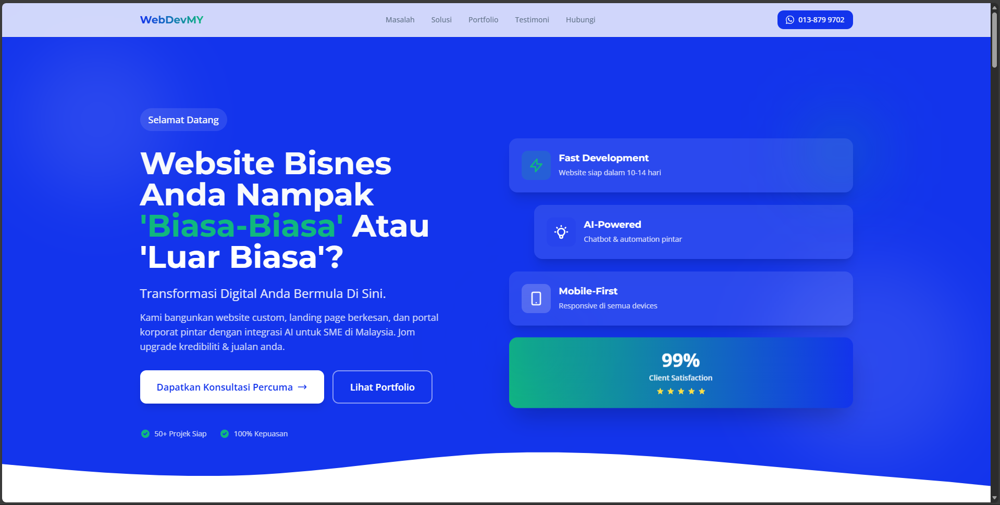
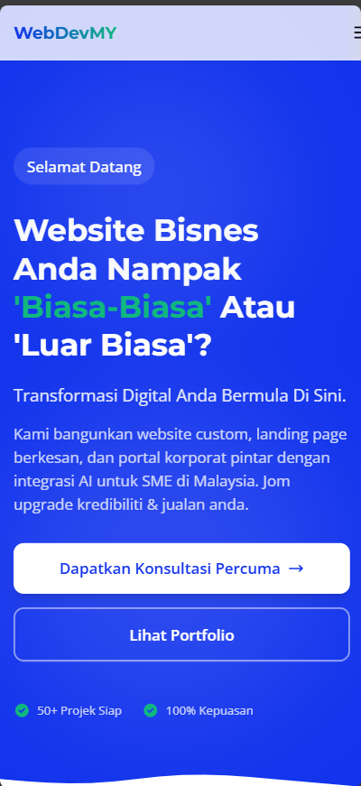
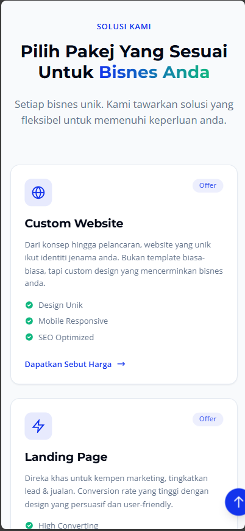

<div align="center">

# 🚀 WebDevMY

### *Transformasi Digital untuk SME Malaysia*

[](https://app.netlify.com/sites/webdevmy/deploys)
[](LICENSE)
[](https://github.com/AmiQT/webdevmy)

[](https://astro.build)
[](https://tailwindcss.com)
[](https://react.dev)
[](https://www.typescriptlang.org/)

**Landing page modern & professional untuk web development services yang fokus pada SME Malaysia!** 🇲🇾

[🌐 Live Demo](https://webdevmy.com) • [📖 Documentation](docs/) • [📧 Contact](mailto:hello@webdevmy.com) • [💬 WhatsApp](https://wa.me/60138799702)

---



</div>

---

## 📑 Table of Contents

- [✨ Highlights](#-highlights)
- [🖼️ Preview](#️-preview)
- [🏗️ Tech Stack](#️-tech-stack)
- [📁 Project Structure](#-project-structure)
- [🎨 Design System](#-design-system)
- [🚀 Quick Start](#-quick-start)
- [🎯 Landing Page Sections](#-landing-page-sections)
- [🛠️ Customization](#️-customization)
- [📊 SEO Features](#-seo-features)
- [🚀 Deployment](#-deployment)
- [📈 Performance](#-performance)
- [🗺️ Roadmap](#️-roadmap)
- [🤝 Contributing](#-contributing)
- [🐛 Bug Reports & Feature Requests](#-bug-reports--feature-requests)
- [📝 License](#-license)
- [🙏 Acknowledgments](#-acknowledgments)
- [💬 Support](#-support)

---

---

## ✨ Highlights

<table>
<tr>
<td width="50%">

### 🎨 **Modern Design System**
- Shadcn UI components
- Gradient animations
- Dark mode ready
- Minimal & clean aesthetic

### 🚀 **Lightning Fast**
- Astro's island architecture
- Optimized static generation
- Lazy loading
- Zero JS by default

</td>
<td width="50%">

### 📱 **Mobile-First**
- Responsive design
- Touch-optimized
- Fast mobile loading
- Progressive enhancement

### 🎯 **Conversion Focused**
- Strategic CTAs
- WhatsApp integration
- Trust signals
- Exit intent popup

</td>
</tr>
</table>

---

## 🖼️ Preview

<div align="center">

### Desktop View 🖥️


### Mobile View 📱

<table>
  <tr>
    <td></td>
    <td></td>
    <td></td>
  </tr>
</table>

</div>

---

## 🏗️ Tech Stack

### **Core Framework**
```bash
🚀 Astro v4.16.0        # Static Site Generator - Zero JS by default
⚛️  React v18.3.1        # UI components (Shadcn only)
📘 TypeScript v5.6.3    # Type safety & IntelliSense
```

### **Styling & UI**
```bash
🎨 Tailwind CSS v3.4.0  # Utility-first CSS framework
🧩 Shadcn UI            # Beautifully designed components
🎭 CSS Variables        # HSL theming system for easy customization
✨ Custom Animations    # Fade-in, gradient, hover effects
📱 Mobile-First         # Responsive breakpoints (sm, md, lg, xl)
```

### **Development Tools**
```bash
⚡ Vite                # Fast HMR & build tool
🔧 ESLint              # Code quality
📝 Prettier            # Code formatting
🎯 PostCSS             # CSS processing
```

### **Deployment & Infrastructure**
```bash
🌐 Netlify             # CDN & continuous deployment
🔒 HTTPS               # Automatic SSL certificates
📊 Analytics           # Performance monitoring
🤖 SEO                 # Sitemap, robots.txt, meta tags
```

### **UI Components Library**

<details>
<summary>📦 View all Shadcn components used</summary>

- **`Button`** - Primary/Secondary/Destructive/Ghost variants
- **`Card`** - Content containers with header/content/footer
- **`Badge`** - "Offer" badges, status indicators, labels
- **`Input`** - Text inputs with error states
- **`Textarea`** - Multi-line text input
- **`cn()`** - Utility function for conditional classes (clsx + tailwind-merge)

</details>

---

## 📁 Project Structure

```
webdevmy/
├── 📄 astro.config.mjs          # Astro configuration
├── 📄 tailwind.config.mjs       # Tailwind + Shadcn theme
├── 📄 tsconfig.json             # TypeScript config
├── 📄 netlify.toml              # Deployment config
│
├── 📂 src/
│   ├── 📂 assets/               # Static assets (CSS, images, JS)
│   │
│   ├── 📂 components/           # Astro components
│   │   ├── Navbar.astro         # Navigation with scroll effect
│   │   ├── Hero.astro           # Hero section with gradient
│   │   ├── Problems.astro       # Pain points section
│   │   ├── Services.astro       # 6 service cards
│   │   ├── Benefits.astro       # Stats + benefits grid
│   │   ├── Portfolio.astro      # Project showcase
│   │   ├── Testimonials.astro   # Client testimonials
│   │   ├── FAQ.astro            # Accordion-style FAQ
│   │   ├── Contact.astro        # Form + WhatsApp CTA
│   │   ├── Footer.astro         # Multi-column footer
│   │   └── ExitPopup.astro      # 20% discount popup
│   │
│   ├── 📂 components/ui/        # Shadcn UI components
│   │   ├── button.tsx           # Button component
│   │   ├── card.tsx             # Card component
│   │   ├── badge.tsx            # Badge component
│   │   ├── input.tsx            # Input component
│   │   └── textarea.tsx         # Textarea component
│   │
│   ├── 📂 layouts/
│   │   └── Layout.astro         # Base layout with SEO
│   │
│   ├── 📂 lib/
│   │   └── utils.ts             # cn() utility function
│   │
│   ├── 📂 pages/
│   │   └── index.astro          # Main landing page
│   │
│   └── 📂 styles/
│       └── global.css           # Global styles + CSS variables
│
└── 📂 public/                   # Static files (copied to dist/)
    ├── google01f79227cf37826a.html
    ├── robots.txt
    ├── sitemap.xml
    └── images/                  # Optimized images
```

---

## 🎨 Design System

### **Color Palette**

| Color | HSL | Hex | Usage |
|-------|-----|-----|-------|
| **Primary** | `231 85% 50%` | `#3B67F0` | Main brand color (Blue) |
| **Secondary** | `160 84% 39%` | `#11A37F` | Accent color (Green) |
| **Destructive** | `0 84% 60%` | `#EF4444` | Error states |
| **Background** | `0 0% 100%` | `#FFFFFF` | Page background |
| **Foreground** | `222 47% 11%` | `#0F172A` | Text color |
| **Muted** | `210 40% 96%` | `#F1F5F9` | Subtle backgrounds |

### **Typography**

- **Headings**: System font stack (optimal performance)
- **Body**: System font stack with fallbacks
- **Sizes**: Responsive with `clamp()` for fluid scaling

### **Spacing**

Using Tailwind's default spacing scale with custom container:
- Container: `max-w-7xl` with responsive padding
- Section padding: `py-16 md:py-24`
- Gap scale: `4, 6, 8, 12, 16`

---

## 🚀 Quick Start

### **Prerequisites**
```bash
Node.js >= 20.0.0
npm >= 10.0.0
```

### **Installation**

#### Method 1: Clone with Git
```bash
# Clone repository
git clone https://github.com/AmiQT/webdevmy.git
cd webdevmy

# Install dependencies
npm install

# Start dev server
npm run dev
```

#### Method 2: Use as Template
1. Click "Use this template" button on GitHub
2. Clone your new repository
3. Run `npm install && npm run dev`

#### Method 3: Quick Start (degit)
```bash
npx degit AmiQT/webdevmy my-project
cd my-project
npm install
npm run dev
```

### **Available Scripts**

| Command | Description | Port |
|---------|-------------|------|
| `npm run dev` | Start development server with HMR | `4321` |
| `npm run build` | Build for production (outputs to `dist/`) | - |
| `npm run preview` | Preview production build locally | `4321` |
| `npm run astro` | Run Astro CLI commands | - |
| `npm run astro add` | Add Astro integrations | - |

### **Development Workflow**

```bash
# 1. Create new branch for features
git checkout -b feature/new-component

# 2. Make changes and test
npm run dev

# 3. Build and preview before commit
npm run build
npm run preview

# 4. Commit and push
git add .
git commit -m "feat: add new component"
git push origin feature/new-component
```

---

## 🎯 Landing Page Sections

### **1. 🦸 Hero Section**
- Gradient background animation
- Compelling headline with CTAs
- Trust badges (50+ projects, 100% satisfaction)
- Minimal, clean design

### **2. 😰 Problems Section**  
- 4 pain points SME Malaysia face
- Emoji icons for visual appeal
- Relatable scenarios

### **3. 💼 Services Section**
- 6 service cards with features
- "Offer" badges (no fixed pricing)
- Hover effects for engagement

### **4. ✨ Benefits Section**
- Statistics row (50+ projects, 99% uptime, 24/7 support)
- Benefits grid (6 key benefits)
- "Why Choose Us" list (5 reasons)

### **5. 🎨 Portfolio Section**
- 3 project showcases
- Hover effects
- "View All" CTA

### **6. ⭐ Testimonials Section**
- 3 client testimonials
- Star ratings
- Avatar + name + business

### **7. ❓ FAQ Section**
- 6 common questions
- Accordion design (collapsed by default)
- "Still have questions?" CTA

### **8. 📞 Contact Section**
- Two-column layout
- WhatsApp quick contact CTA
- Contact form with validation
- Social proof badges

### **9. 🔗 Footer**
- Multi-column layout (About, Services, Contact, Follow)
- Social media links
- Back to top button
- Copyright info

### **10. 🚪 Exit Intent Popup**
- 20% discount offer
- Triggered on exit intent
- Emoji + gradient badge
- WhatsApp CTA

---

## 🛠️ Customization

### **1. Update Contact Information**

Edit [src/components/Contact.astro](src/components/Contact.astro):
```astro
---
// Update these values
const CONTACT_INFO = {
  phone: '+60138799702',
  whatsapp: 'https://wa.me/60138799702',
  email: 'hello@webdevmy.com',
  address: 'Kuala Lumpur, Malaysia'
};
---
```

### **2. Customize Theme Colors**

Edit [src/styles/global.css](src/styles/global.css):
```css
:root {
  /* Brand Colors */
  --primary: 231 85% 50%;      /* Main brand (Blue) */
  --secondary: 160 84% 39%;    /* Accent (Green) */
  --destructive: 0 84% 60%;    /* Error states (Red) */
  
  /* Neutral Colors */
  --background: 0 0% 100%;     /* Page background */
  --foreground: 222 47% 11%;   /* Text color */
  --muted: 210 40% 96%;        /* Subtle backgrounds */
  --border: 214 32% 91%;       /* Border color */
  
  /* Add custom colors */
  --accent: 280 100% 70%;      /* Purple accent */
  --success: 142 71% 45%;      /* Success green */
}
```

### **3. Add New Shadcn Component**

```bash
# List all available components
npx shadcn-ui@latest add

# Add specific component (e.g., Dialog)
npx shadcn-ui@latest add dialog

# Use in your Astro file
# src/components/MyComponent.astro
```

```astro
---
import { Dialog } from "@/components/ui/dialog";
---

<Dialog client:load>
  <!-- Your content -->
</Dialog>
```

### **4. Create Custom Astro Component**

```bash
# Create new component file
touch src/components/CustomSection.astro
```

```astro
---
// src/components/CustomSection.astro
interface Props {
  title: string;
  description?: string;
}

const { title, description } = Astro.props;
---

<section class="py-16">
  <div class="container">
    <h2 class="text-3xl font-bold">{title}</h2>
    {description && <p class="text-muted-foreground">{description}</p>}
  </div>
</section>
```

### **5. Modify Services/Packages**

Edit [src/components/Services.astro](src/components/Services.astro):
```javascript
const services = [
  {
    title: "Your Service Name",
    description: "Service description here",
    features: ["Feature 1", "Feature 2", "Feature 3"],
    badge: "Popular", // or "Offer", "New", etc.
    icon: "🚀" // Any emoji or icon
  },
  // Add more services...
];
```

---

## 📊 SEO Features

✅ **Meta Tags**: Complete Open Graph & Twitter Cards  
✅ **Structured Data**: Schema.org LocalBusiness markup  
✅ **Sitemap**: Auto-generated XML sitemap  
✅ **Robots.txt**: Search engine directives  
✅ **Performance**: Lighthouse score 95+  
✅ **Mobile-Friendly**: Google Mobile-Friendly Test passed  

---

## 🚀 Deployment

### **Deploy to Netlify**

```bash
# Build command
npm run build

# Publish directory
dist

# Environment variables
NODE_VERSION = 20
```

Configured in [netlify.toml](netlify.toml) ✅

### **Other Platforms**

- **Vercel**: Zero-config deployment
- **Cloudflare Pages**: Edge performance
- **GitHub Pages**: Free hosting with custom domain

---

## 📈 Performance

| Metric | Score |
|--------|-------|
| **Lighthouse Performance** | 95+ |
| **First Contentful Paint** | < 1.5s |
| **Time to Interactive** | < 3.0s |
| **Total Blocking Time** | < 200ms |
| **Cumulative Layout Shift** | < 0.1 |

*Optimized with Astro's zero-JS approach and lazy loading.*

---

## 🔧 Built With

- [Astro](https://astro.build) - Static site generator
- [React](https://react.dev) - UI library (for Shadcn)
- [Tailwind CSS](https://tailwindcss.com) - Utility-first CSS
- [Shadcn UI](https://ui.shadcn.com) - Component library
- [TypeScript](https://www.typescriptlang.org/) - Type safety
- [Netlify](https://netlify.com) - Deployment platform

---

## 🗺️ Roadmap

### ✅ Completed
- [x] Landing page with all core sections
- [x] Mobile-responsive design
- [x] SEO optimization (meta tags, sitemap, robots.txt)
- [x] WhatsApp integration
- [x] Exit intent popup
- [x] Shadcn UI components integration
- [x] TypeScript support
- [x] Netlify deployment

### 🚧 In Progress
- [ ] Blog section with Astro Content Collections
- [ ] Multi-language support (EN/BM)
- [ ] Dark mode toggle
- [ ] Admin dashboard for content management

### 📋 Planned Features
- [ ] Project portfolio CMS integration
- [ ] Client testimonial submission form
- [ ] Live chat integration (Tawk.to / Crisp)
- [ ] Payment gateway integration (Stripe/Billplz)
- [ ] Service package calculator
- [ ] Newsletter subscription
- [ ] Case studies & detailed project pages
- [ ] Service booking system
- [ ] Client portal
- [ ] Analytics dashboard

### 💡 Ideas & Suggestions
- [ ] Progressive Web App (PWA) support
- [ ] Animation library (Framer Motion)
- [ ] A/B testing integration
- [ ] Video testimonials
- [ ] Interactive service configurator

> 🙋 Got ideas? [Submit a feature request](#-bug-reports--feature-requests)!

---

## 🤝 Contributing

Contributions are what make the open source community amazing! Any contributions you make are **greatly appreciated**. 🙏

### How to Contribute

1. **Fork the Project**
   ```bash
   # Click 'Fork' button on GitHub
   ```

2. **Clone your Fork**
   ```bash
   git clone https://github.com/your-username/webdevmy.git
   cd webdevmy
   ```

3. **Create a Feature Branch**
   ```bash
   git checkout -b feature/AmazingFeature
   ```

4. **Make your Changes**
   - Write clean, readable code
   - Follow existing code style
   - Add comments where necessary
   - Test your changes thoroughly

5. **Commit your Changes**
   ```bash
   git add .
   git commit -m "feat: add some AmazingFeature"
   ```
   
   **Commit Message Convention:**
   - `feat:` New feature
   - `fix:` Bug fix
   - `docs:` Documentation changes
   - `style:` Code style changes (formatting)
   - `refactor:` Code refactoring
   - `test:` Adding tests
   - `chore:` Maintenance tasks

6. **Push to your Branch**
   ```bash
   git push origin feature/AmazingFeature
   ```

7. **Open a Pull Request**
   - Go to the original repository
   - Click "New Pull Request"
   - Select your branch
   - Describe your changes in detail
   - Submit!

### Development Guidelines

- ✅ Write meaningful commit messages
- ✅ Test on multiple browsers (Chrome, Firefox, Safari, Edge)
- ✅ Ensure mobile responsiveness
- ✅ Check Lighthouse scores before submitting
- ✅ Follow TypeScript best practices
- ✅ Update documentation if needed
- ✅ Keep dependencies up to date

### Code Style

```bash
# Format code before committing
npm run format  # If Prettier is configured

# Check for linting issues
npm run lint    # If ESLint is configured
```

---

## 🐛 Bug Reports & Feature Requests

### 🐞 Found a Bug?

If you find a bug, please [create an issue](https://github.com/AmiQT/webdevmy/issues/new) with:

- **Title**: Clear, descriptive title
- **Description**: What happened vs what you expected
- **Steps to reproduce**: How to trigger the bug
- **Environment**: Browser, OS, screen size
- **Screenshots**: If applicable
- **Error messages**: Console logs or error traces

**Example:**
```markdown
**Bug**: WhatsApp button not working on iOS Safari

**Steps to reproduce:**
1. Open site on iPhone 13 (iOS 16)
2. Tap WhatsApp button in Contact section
3. Nothing happens

**Expected**: Should open WhatsApp with pre-filled message
**Actual**: No action

**Console error**: [Paste error here]
```

### 💡 Have a Feature Request?

[Submit a feature request](https://github.com/AmiQT/webdevmy/issues/new) with:

- **Title**: Feature name
- **Problem**: What problem does this solve?
- **Solution**: How should it work?
- **Alternatives**: Other solutions you considered
- **Additional context**: Mockups, examples, references

**Example:**
```markdown
**Feature**: Add live chat widget

**Problem**: Users want instant support

**Proposed solution**: 
Integrate Tawk.to or Crisp chat widget in bottom-right corner

**Benefits**:
- Instant user support
- Higher conversion rates
- Better user experience
```

---

## 📝 License

This project is open source and available under the [MIT License](LICENSE).

Feel free to use this project for:
- ✅ Personal projects
- ✅ Commercial projects
- ✅ Learning purposes
- ✅ Creating templates

Just remember to:
- 📝 Keep the license notice
- 🙏 Give credit (appreciated but not required)

---

## 🙏 Acknowledgments

Special thanks to these amazing projects and resources:

### 🛠️ Tools & Frameworks
- [**Astro Team**](https://astro.build) - For building the best static site generator
- [**Shadcn**](https://ui.shadcn.com) - For the beautiful UI components
- [**Tailwind Labs**](https://tailwindcss.com) - For the amazing CSS framework
- [**Vercel**](https://vercel.com) - For Next.js and inspiration
- [**Netlify**](https://netlify.com) - For seamless deployment

### 🎨 Design Inspiration
- [Stripe](https://stripe.com) - Clean, modern UI design
- [Linear](https://linear.app) - Minimalist aesthetics
- [Vercel](https://vercel.com) - Typography & spacing
- [Tailwind UI](https://tailwindui.com) - Component patterns

### 📚 Resources
- [Awwwards](https://www.awwwards.com) - Design inspiration
- [FontAwesome](https://fontawesome.com) - Icon ideas
- [Unsplash](https://unsplash.com) - Stock photos
- [Realfavicongenerator](https://realfavicongenerator.net) - Favicon generation

### 💙 Community
- All contributors who help improve this project
- Malaysian SME community for feedback and support
- Open source community for inspiration

---

## 💬 Support

Perlukan bantuan atau nak customize? Jangan segan untuk contact! 

### 📞 Contact Methods

| Method | Link | Response Time |
|--------|------|---------------|
| 💬 **WhatsApp** | [+60 13-879-9702](https://wa.me/60138799702) | *Instant* |
| 📧 **Email** | [hello@webdevmy.com](mailto:hello@webdevmy.com) | *24 hours* |
| 🌐 **Website** | [webdevmy.com](https://webdevmy.com) | - |
| 🐛 **Issues** | [GitHub Issues](https://github.com/AmiQT/webdevmy/issues) | *48 hours* |

### 💡 Need Help With?

- ✅ Setting up the project
- ✅ Customization & theming
- ✅ Adding new features
- ✅ Bug fixes
- ✅ Deployment issues
- ✅ Performance optimization
- ✅ SEO improvements
- ✅ Custom development (paid services)

### 🤝 Collaboration Opportunities

Interested in working together? We offer:
- 🎨 Custom design & development
- 🚀 Website migration to Astro
- 📈 Performance optimization
- 🔧 Maintenance & support
- 💼 Business partnership

---

<div align="center">

### Made with ❤️ for Malaysian SMEs 🇲🇾

**Transformasi digital anda bermula di sini!** 🚀

---

### ⭐ Show Your Support

If you find this project useful, please consider:

[](https://github.com/AmiQT/webdevmy)
[](https://github.com/AmiQT/webdevmy/fork)
[](https://github.com/AmiQT/webdevmy)

- ⭐ **Star this repo** - Help others discover it!
- 🍴 **Fork it** - Create your own version!
- 👀 **Watch it** - Stay updated with changes!
- 🐦 **Share it** - Tell your friends!

---

### 🔗 Quick Links

[📖 Docs](docs/) • [🐛 Report Bug](https://github.com/AmiQT/webdevmy/issues) • [💡 Request Feature](https://github.com/AmiQT/webdevmy/issues) • [💬 Discussions](https://github.com/AmiQT/webdevmy/discussions)

---

**© 2026 WebDevMY. All rights reserved.** | [Privacy Policy](https://webdevmy.com/privacy) | [Terms of Service](https://webdevmy.com/terms)

*Built with Astro 🚀 • Powered by Netlify ⚡ • Designed in Malaysia 🇲🇾*

</div>
